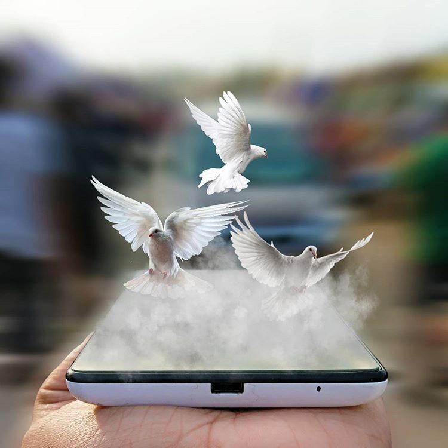
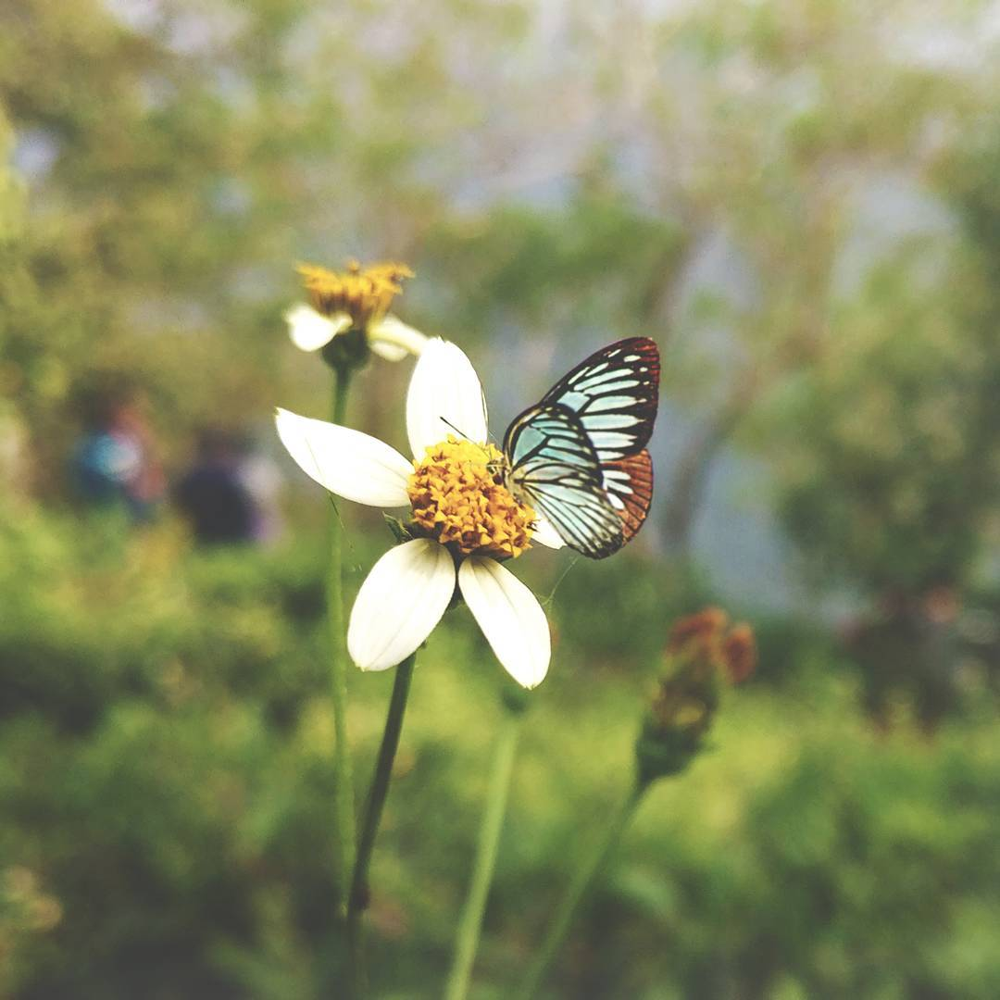
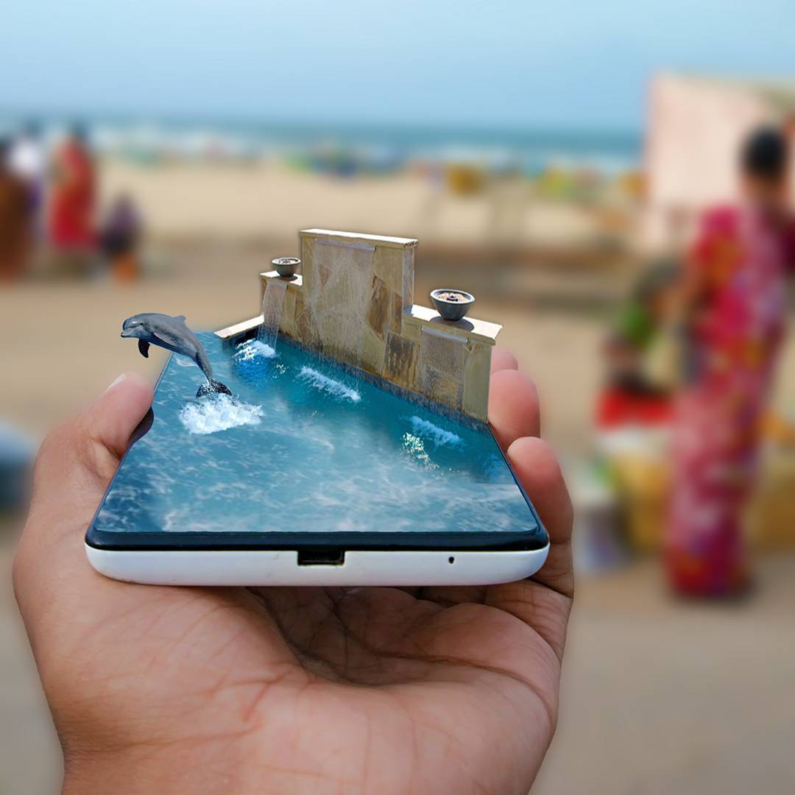
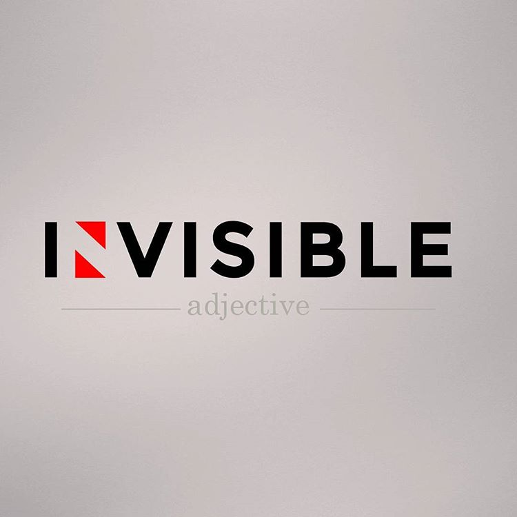
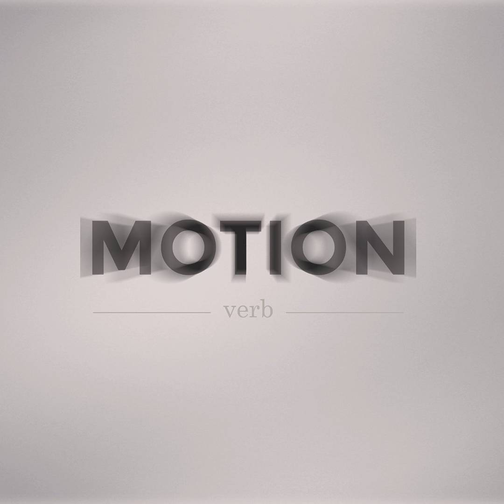
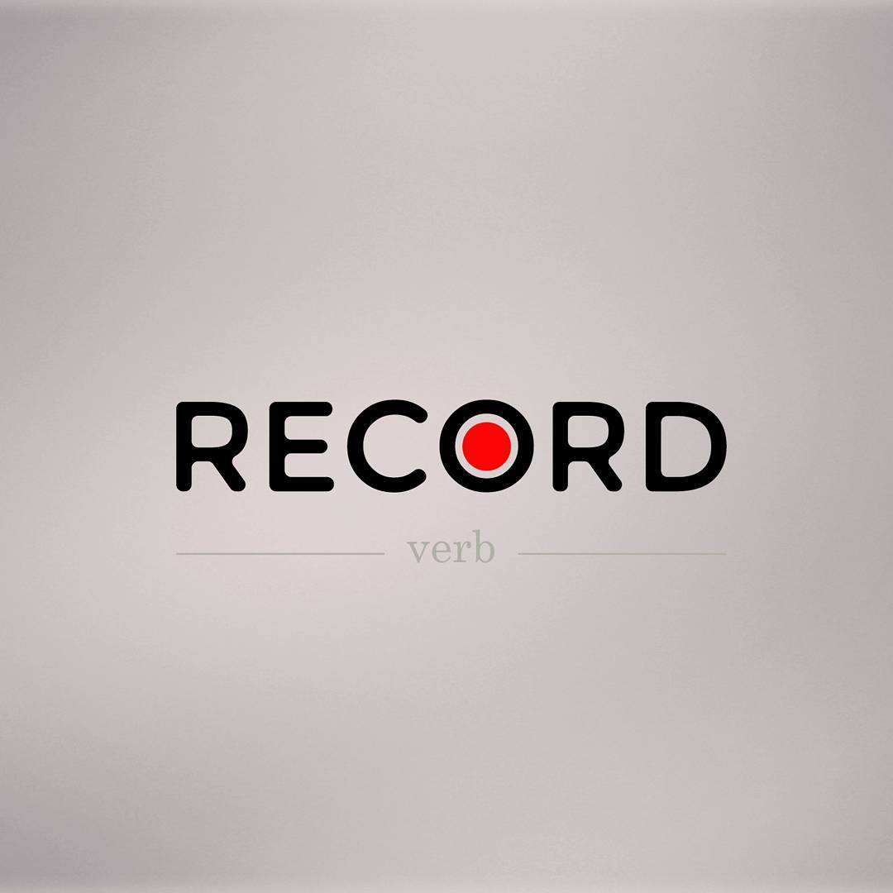

# What Else
{: .no_toc }

## Table of contents
{: .no_toc .text-delta }

1. TOC
{:toc}

---

## Photo Maniupluation

A good photo manipulation technique invovles but not limited to taking care of color-blending, lights and shadow, along with a perspective to put the result into.

    

        

        
        

        

        
        

        

        
        

    

## Logo Designing

Logo designing brings about creativity and imagination to identify the values, cultre and the behaviour of a product and convey the same using either graphical representation, textual representation or both.

    

        

        
        

        

        
        

        

        
        

    

